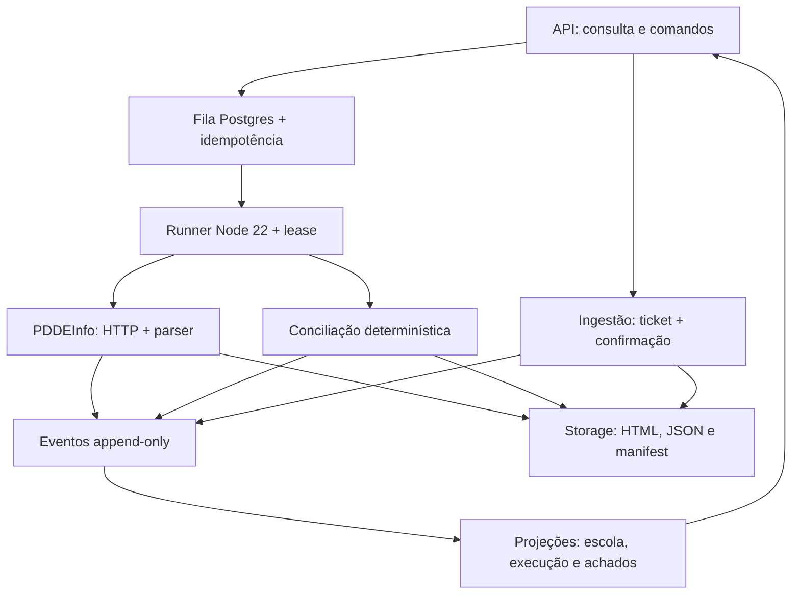

# Arquitetura atual e direção de evolução

## Estado atual — v0.5.0

O repositório cobre seis responsabilidades separadas:

1. coleta autônoma e validação do PDDEInfo;
2. preservação append-only de evidências e artefatos;
3. conciliação determinística entre fontes;
4. projeções de leitura por execução e por escola;
5. API institucional de consulta e comando;
6. execução longa por fila Postgres e runner confiável.

A arquitetura continua deliberadamente determinística. IA, navegador automatizado ou agentes podem auxiliar coleta e diagnóstico, mas não decidem o resultado financeiro final.

## Fluxo atual



Observação de fonte e conclusão derivada permanecem separadas. Eventos gerados pelo motor usam origem `CONCILIADOR`; eles não são apresentados como se tivessem sido observados diretamente no PDDEInfo ou SIGEF.

## Modelo de evidência

`backend/core/evidence.ts` define eventos canônicos:

- `EXECUTION_REQUESTED`;
- `EXECUTION_STARTED`;
- `EXECUTION_FINISHED`;
- `SOURCE_ATTEMPT_RECORDED`;
- `ARTIFACT_PRESERVED`;
- `OBSERVATION_RECORDED`;
- `FINDING_RECORDED`.

Cada evento persistido possui:

- `eventId` único;
- `runId`;
- sequência monotônica;
- origem;
- exercício;
- INEP opcional;
- data/hora;
- payload tipado;
- `previousHash`;
- `eventHash` SHA-256.

### Adaptador JSONL

`backend/adapters/jsonl-evidence-store.ts` implementa o contrato imediatamente utilizável:

- append serializado mesmo com escolas processadas em paralelo;
- rejeição de `eventId` duplicado;
- verificação da cadeia antes de novos appends;
- detecção de adulteração, quebra de sequência e divergência de hash;
- leitura por execução, por escola ou integral.

O arquivo padrão é:

```text
<workspace>/evidence/events.jsonl
```

### Postgres / Supabase

As migrations `20260813050000_evidence_events.sql` e `20260813064845_institutional_backend.sql` materializam o backend:

- `pgcrypto` para SHA-256;
- índices por execução, escola e fonte/exercício;
- RLS habilitado e forçado;
- sem leitura/escrita para `anon` ou `authenticated` nesta etapa;
- `UPDATE` e `DELETE` bloqueados por trigger;
- append por função `SECURITY DEFINER` concedida apenas a `service_role`;
- `pg_advisory_xact_lock` serializa sequência e cadeia de hashes.
- bucket privado único `pdde-evidence`, limitado a tipos e tamanho conhecidos; comandos e adaptador recusam referências a qualquer outro bucket;
- `execution_jobs` com idempotência, owner, lease e limite de tentativas;
- claim/conclusão atômicos com `EXECUTION_STARTED`/`EXECUTION_FINISHED`;
- projeção `execution_read_models` reconstruída integralmente do log;
- índices parciais para achados e paginação por cursor.

`SupabaseEvidenceStore`, `SupabaseArtifactStore`, `SupabaseExecutionQueue` e `SupabaseInstitutionalReadRepository` mantêm o SDK no limite de infraestrutura. Domínio e casos de uso conhecem apenas portas próprias. `ArtifactIntakeService` coordena tickets assinados para JSON/CSV/XLS, registra a solicitação sem guardar o token temporário e só preserva o artefato após baixar e validar tamanho e SHA-256. Um único validador governa o namespace `runs/<runId>/...` na ingestão, nos comandos e no adaptador: `:` é permitido somente no segmento de `runId`, enquanto segmentos vazios, `.`/`..`, barras invertidas e caracteres fora do subconjunto institucional são recusados.

As migrations ainda **não foram aplicadas a um projeto Supabase dedicado**. A criação de `pdde-repasse-conciliador` em `sa-east-1`, a custo informado de US$ 0/mês, foi recusada pelo limite de projetos gratuitos ativos. Bancos de outras aplicações não foram reutilizados.

## API e execução assíncrona

`backend/api/institutional-api.ts` implementa o contrato com Web `Request`/`Response`; `backend/runtime/node-api-server.ts` é apenas o adaptador HTTP Node. Essa separação mantém o contrato testável sem depender de um provedor específico.

O processo HTTP possui lifecycle explícito. Em `SIGTERM`/`SIGINT`, o listener para de aceitar conexões, conexões ociosas são fechadas e respostas ativas podem terminar antes da saída. O período gracioso é limitado a 30 segundos por padrão e configurável entre 1 e 120 segundos; conexões remanescentes são encerradas ao fim do prazo. O listener temporário de erro do startup é removido depois de `listening`; erros posteriores permanecem falhas observáveis pelo supervisor.

O health expõe o resultado da auditoria criptográfica integral sem executar uma varredura por GET: verificações simultâneas compartilham a mesma promise e o resultado é reutilizado por 10 segundos. A auditoria permanece completa; apenas seu acionamento no hot path é limitado.

Os `POST` protegidos criam um job e retornam `202 + runId`. O runner:

1. reclama um job usando `FOR UPDATE SKIP LOCKED`;
2. registra início na mesma transação;
3. usa workspace isolado por `jobId/tentativa`;
4. renova o lease por heartbeat;
5. executa coleta ou conciliação existente;
6. conclui `COMPLETE`, `PARTIAL` ou `FAILED` e registra o evento terminal atomicamente.

Uma execução abandonada pode ser reclamada. Ao alcançar `max_attempts`, o próximo ciclo fecha o job como falha explícita. Paths de Storage são imutáveis; uma repetição só é aceita se o conteúdo possuir o mesmo SHA-256.

O processo aceita `SIGTERM`/`SIGINT` de forma graciosa: cancela a espera ociosa, mas não abandona um job já reclamado. Falhas de infraestrutura no claim, heartbeat ou fechamento propagam-se ao supervisor. Em particular, uma falha ao chamar a RPC terminal após o executor produzir `COMPLETE`/`PARTIAL` não dispara uma segunda conclusão `FAILED`, pois o primeiro resultado pode já ter sido confirmado no Postgres apesar da perda da resposta.

Arquivos operacionais entram por um fluxo administrativo separado: a API autoriza um path estável com `upsert: false`, o cliente envia os bytes diretamente ao Storage com ticket de duas horas e a confirmação protegida produz o evento append-only. A chave administrativa da API e a credencial `service_role` nunca são entregues ao cliente.

Ao receber `POST /api/reconciliations`, `ExecutionCommandService` não trata as referências do cliente como prova. Para PDDEInfo, Movimentações e cada Liberação, ele consulta o log pelo proprietário de `runs/<runId>/...` e exige um `ARTIFACT_PRESERVED` institucional que coincida exatamente em bucket, path, SHA-256, exercício, origem e tipo/papel. O coletor marca a carteira consolidada como `PDDEINFO_JSON`, e a ingestão marca CSV/XLS com seus papéis próprios; metadado de papel ausente nunca funciona como curinga. A ausência ou divergência encerra o comando com conflito antes do enqueue.

O pedido HTTP permanece estrito e não aceita `sourceCollectionRunId`. Esse campo só existe no payload interno da fila quando o artefato PDDEInfo pertence a um ciclo conhecido do mesmo exercício cujo evento mais recente é `EXECUTION_FINISHED` com status `COMPLETE`. Uploads confirmados sem ciclo continuam utilizáveis como entradas avulsas, mas não são apresentados como coleta de origem. A função Postgres de claim apenas copia esse valor validado; ela não o deduz do path. O runner também passa esse valor (inclusive `null`) explicitamente ao conciliador, impedindo que um `runId` autodeclarado dentro do JSON recupere o vínculo descartado pela validação institucional.

O histórico escolar é paginado por `sequence`, com 50 eventos por padrão e teto de 100. O Postgres filtra `school_inep`, calcula a página e consulta em lotes apenas as projeções materializadas dos `runId` presentes nela; não carrega todos os eventos de cada execução para reconstruir a resposta. Como as projeções derivam exclusivamente do log append-only, continuam descartáveis e reconstruíveis.

No staging de Liberações, o runner deriva `CNPJ__PROGRAMA.xls` do conteúdo validado, não do basename do objeto. Assim, paths opacos do Storage continuam compatíveis com o carregador canônico e nomes fornecidos pelo cliente não governam identidade financeira.

## Coleta PDDEInfo

Principais módulos:

1. `pddeinfo-http.ts` realiza a consulta pública por INEP com timeout/retry e teto de 10 MB lido em streaming;
2. `pddeinfo-html.ts` interpreta e valida a identidade retornada;
3. `pddeinfo-normalizer.ts` converte a resposta em pagamentos esperados;
4. `collect-pddeinfo.ts` orquestra lotes, preserva artefatos e registra a execução;
5. `scripts/collect-pddeinfo.ts` cria automaticamente a trilha de evidências e verifica sua integridade.

Uma falha de fonte é registrada como tentativa falha da escola. Uma falha do próprio armazenamento de auditoria não é mascarada como falha da escola: a execução é interrompida.

## Conciliação

Principais módulos:

1. `sigef-release-inspector.ts` identifica metadados das exportações;
2. `load-sigef-release-exports.ts` importa manifesto ou pasta canônica;
3. `sigef-releases-html.ts` interpreta os `.xls` HTML/Windows-1252;
4. `sigef-movements-csv.ts` lê o CSV em streaming;
5. `reconciliation-pipeline.ts` valida procedência/cobertura;
6. `portfolio-reconciliation.ts` resolve candidatos sem inferência silenciosa;
7. `reconciliation.ts` produz estado e código de razão;
8. `reconcile-files.ts` gera o Excel e registra execução, achados e relatório na trilha;
9. `reconciliation-workbook.ts` gera, relê e audita o workbook.

Quando o PDDEInfo veio do layout padrão do coletor, `scripts/reconcile.ts` encontra automaticamente a mesma trilha de evidências. Uma execução do conciliador registra qual `runId` de coleta lhe serviu como origem.

## Leitura e projeções

`backend/application/evidence-history.ts` reconstrói o estado a partir dos eventos, sem criar uma segunda tabela mutável de “resumo atual”. No Postgres, a view `execution_read_models` executa a mesma projeção no servidor; ela pode ser descartada e reconstruída a qualquer momento.

As projeções já disponíveis incluem:

- status, início e fim de uma execução;
- origem e exercício;
- vínculo da conciliação com a coleta anterior;
- contagem de tentativas, falhas, artefatos, achados e revisões humanas;
- linha do tempo por INEP.
- listagem paginada de execuções e achados;
- referências de artefatos e download curto assinado do relatório.
- emissão e confirmação idempotentes de uploads institucionais, com auditoria da solicitação e do conteúdo efetivamente preservado.

Lotes usados somente para ingestão continuam integralmente no log e na consulta de artefatos, mas não entram em `execution_read_models` sem ao menos um evento de ciclo de vida (`EXECUTION_REQUESTED`, `EXECUTION_STARTED` ou `EXECUTION_FINISHED`). Isso evita apresentar uma entrada operacional como execução `UNKNOWN`.

O histórico escolar primeiro obtém os eventos diretamente associados ao INEP e depois busca somente as execuções relacionadas. Os `runId` são deduplicados e consultados em lotes conservadores de 40, com paginação interna e ordenação global por sequência; assim, o endpoint não volta a varrer o log inteiro e também não falha quando uma escola ultrapassa 500 execuções históricas.

`scripts/inspect-evidence.ts` expõe essas projeções por CLI e verifica a integridade da cadeia antes de apresentar resultados.

## Invariantes

- dinheiro é comparado em centavos inteiros;
- CNPJ, banco, agência, conta, INEP, código SME e OB permanecem texto;
- fonte ausente ou cobertura insuficiente nunca vira confirmação nem ausência definitiva;
- observação externa e conclusão derivada permanecem semanticamente separadas;
- eventos já persistidos não são reescritos para simular estado atual;
- conta divergente entre fontes nunca é escolhida automaticamente;
- conta ausente no PDDEInfo não é inferida de histórico ou programa diferente;
- cabeçalho, destinação ou estrutura desconhecida geram erro explícito;
- conteúdo externo capaz de virar fórmula no Excel é neutralizado;
- o workbook final é relido e validado antes de ser considerado concluído.

## Validação de escala

No baseline v0.4 de 13/08/2026, a coleta real das 163 unidades foi repetida com a persistência ligada:

- 163/163 escolas concluídas;
- 520 registros financeiros;
- 169 com pagamento informado;
- 47 sem conta correspondente de programa na visão consultada;
- 0 warnings de normalização;
- 493 eventos append-only;
- cadeia de integridade validada integralmente.

Na revalidação posterior da v0.5, a fonte retornou 468 linhas financeiras brutas e o normalizador produziu exatamente 468 registros; 169 pagamentos, 47 ausências de conta, 0 warnings, 163/163 escolas e 493/493 hashes permaneceram estáveis. A distribuição das 468 linhas recebidas explica a diferença sem alterar regras: 111 + 111 parcelas regulares, 52 Primeira Infância P1, 145 Educação Conectada, 43 Escola e Comunidade e 6 Escola das Adolescências.

## Limites entre código atual e legado

| Área | Classificação | Regra de evolução |
|---|---|---|
| `backend/core`, `backend/adapters`, `backend/application`, `backend/report` | canônico ativo | origem das regras, portas e implementações v0.5 |
| `backend/api`, `backend/runtime`, `scripts` | canônico ativo | operação institucional e CLI |
| `supabase/migrations`, testes | canônico ativo | schema, contratos e regressões |
| `src/` | reaproveitável/transicional | a aplicação Vite ainda compila, mas não é a UI institucional final; nunca recebe `service_role` |
| `backend/index.ts`, `backend/realtime.ts`, `backend/realtime-subscribers.ts` | legado AppDeploy | permanece como referência; está fora do typecheck canônico e não é importado pelo runtime v0.5 |
| `SOURCE_MANIFEST.json` | snapshot histórico | não é manifesto dinâmico da v0.5 e não deve dirigir cópia cega de código |

Nenhum arquivo legado foi apagado ou ligado implicitamente ao novo runtime.

## Direção de UX

A aplicação deve mostrar primeiro execução, escola, resumo financeiro, exceções e ações úteis. Hashes, URLs, parser e demais metadados permanecem acessíveis numa camada secundária de rastreabilidade.

As implementações paralelas continuam sendo referência de UX, especialmente para hierarquia visual, estados semânticos, alto contraste, teclado e responsividade, sem herança automática de seus runtimes.

## Limites atuais

- obtenção autônoma do SIGEF continua limitada por CAPTCHA em rotas relevantes;
- a API/runner estão implementados, mas ainda não possuem plataforma canônica de deploy;
- as migrations estão prontas, mas o limite da conta impediu criar/aplicar o Supabase exclusivo;
- o teste live de Storage/fila/cadeia permanece opt-in até existir esse projeto;
- autenticação de usuário final e interface web institucional ainda não estão integradas;
- arquivos operacionais grandes permanecem fora do Git quando não agregam valor ao histórico do código.

## Dependência transitiva

O ExcelJS 4.4.0 ainda declara `uuid ^8.3.0`. O projeto força `uuid 11.1.1`, versão corrigida para a vulnerabilidade transitiva monitorada. Geração, serialização e releitura do workbook permanecem cobertas por testes. O override deve ser removido quando uma futura versão do ExcelJS atualizar sua dependência nativa.
